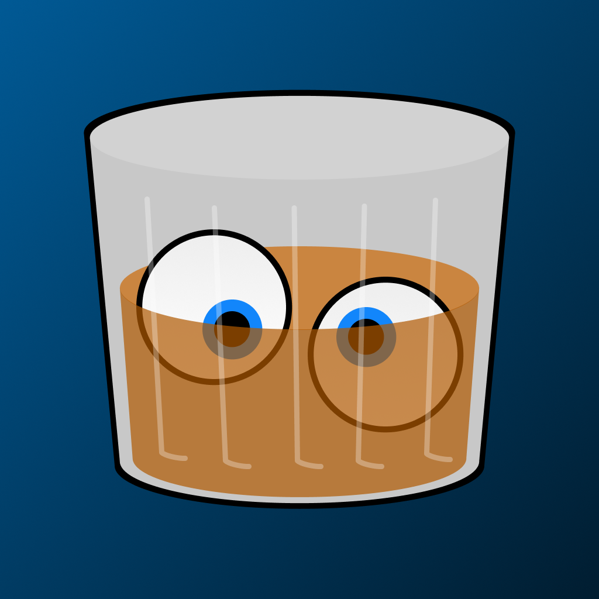

<div style="display: flex; align-items: center; gap: 8px;">
  
  <h1 style="margin: 0;">RYE (Rest-Your-Eyes)</h1>
</div>

macOS app that reminds you to rest your eyes with a full-screen countdown.

## Installation

```bash
brew install blchelle/tap/rye
```

## Development Setup

```bash
npm install
npm run build:web
```

## Run

```bash
npm start
```

## Build macOS App

```bash
npm run build
```

The app will be in `dist/` folder.

## How It Works

- Triggers at configurable intervals (defaults to every 20 minutes).
- Shows full-screen modal with countdown.
- Can be configured allow dismissal or force you to wait.
- Countdown duration is customizable (default to 20s).
- Does not appear during screen recording or screen sharing.
